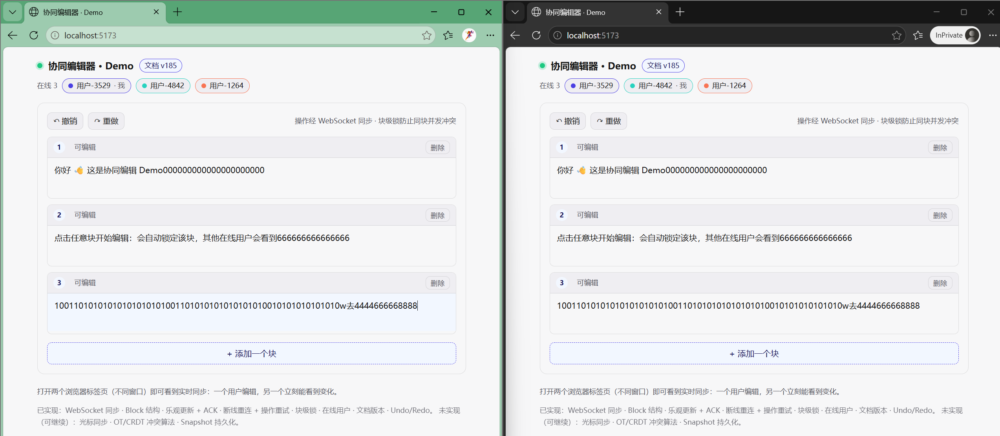
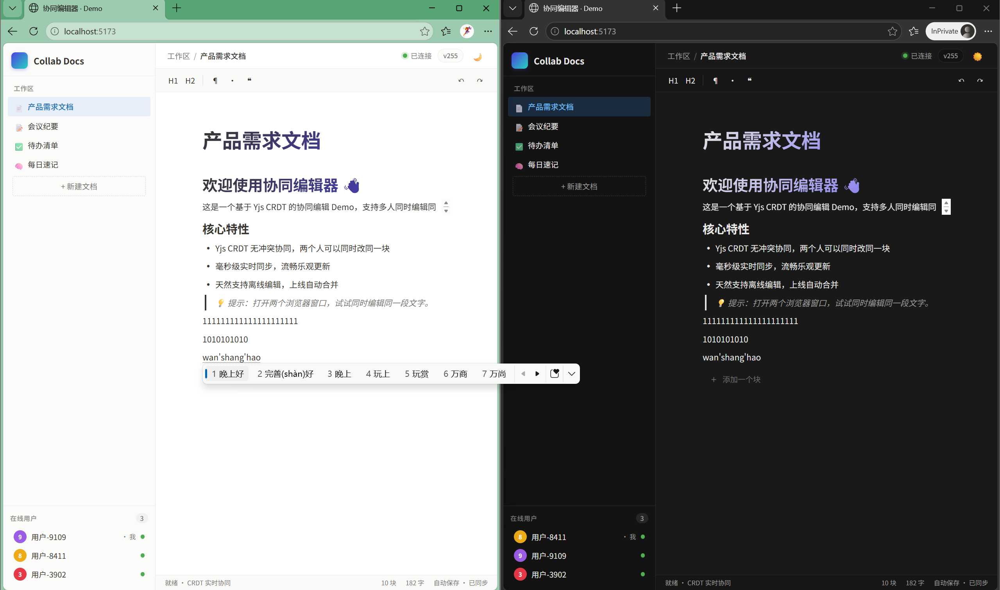
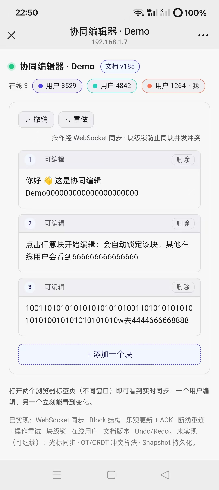
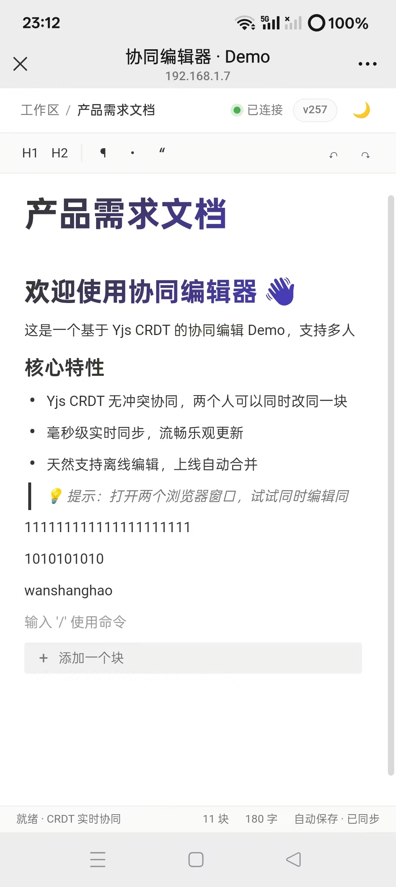

# 协同编辑器 · 面试作品

基于 DOM 渲染的协同编辑器，从 **块锁 + 手写协议** 演进到 **CRDT（Yjs）**，完整记录思考过程与设计权衡。

> 🎯 题目要求的不是"功能数量"，而是"思考过程"。这个项目的价值在于：**两个版本的对比与演进**。

## 演进概览

| v1 朴素版（块锁）                                                                              | v2 精致版（块级 CRDT）                                                                         |
| --------------------------------------------------------------------------------------- | --------------------------------------------------------------------------------------- |
|                                              |                                            |
| 块锁 + 手写协议                                                                               | 块级 CRDT（Yjs）                                                                            |
| 核心优先，UI 朴素                                                                              | 类 Notion 风格，体验升级                                                                        |
| [`v1-block-lock`](https://github.com/wkyzcrhs/collab-editor/releases/tag/v1-block-lock) | [`v2-crdt-block`](https://github.com/wkyzcrhs/collab-editor/releases/tag/v2-crdt-block) |

**v3 计划中**：字符级 CRDT（Y.Text）→ 真正的无冲突合并

技术栈：0

- 前端：React + TypeScript + Vite

- 后端：Node.js + tsx + ws（WebSocket）

- 协同 v1：手写协议（乐观更新 / ACK / 重试 / 幂等 / 重连 / 块锁）

- 协同 v2：Yjs（CRDT）+ y-protocols

- UI：类 Notion 风格侧边栏 / 工具栏 / 深色模式 / 5 种块类型

## 移动端测试

手机与电脑同一 WiFi 下通过局域网 IP 访问，验证两端实时协同效果。

| v1 朴素版（块锁）                                                           | v2 精致版（块级 CRDT）                                                        |
| -------------------------------------------------------------------- | ---------------------------------------------------------------------- |
|  |  |
| 两端都可编辑，同一块并发内容按到达顺序拼接（先到的在前）                                         | 块级 CRDT，两端同时编辑，操作保留但可能出现重复块                                            |
| 版本号、在线用户、Undo/Redo 正常                                                | 在线用户、版本计数、深色模式正常                                                       |

> 验证了 WebSocket 地址自动跟随页面域名，局域网访问开箱即用。

## 快速开始

```bash
# 1. 安装依赖
npm run install:all

# 2. 同时启动 后端(:8787) 与 前端(:5173)
npm run dev

# 3. 打开两个浏览器窗口
#    http://localhost:5173
```

手动分开跑：

```bash
npm --prefix server run start  # ws://localhost:8787
npm --prefix client run dev    # http://localhost:5173
```

**手机 / 局域网访问**：前端默认监听所有地址，启动后用 `Network` 那个 IP 访问（如 `http://192.168.1.7:5173`），WebSocket 地址自动跟随页面域名。

## 已实现功能（对照题目加分项）

| 板块               | 状态        | 说明                                  |
| ---------------- | --------- | ----------------------------------- |
| WebSocket 同步     | ✅         | Yjs sync + update 协议，增量同步           |
| Block / Block ID | ✅         | 每块唯一 ID，块级共享数组                      |
| 乐观更新             | ✅         | 本地立即生效，Yjs 后台同步                     |
| ACK              | ⚠️ 不再需要   | CRDT 最终一致 + 幂等，不需要 ACK 队列           |
| 断线重连             | ✅         | y-websocket 内置自动重连                  |
| 操作重试             | ⚠️ 不再需要   | update 消息幂等，重复收到无副作用                |
| Block 锁          | ❌ 已移除     | CRDT 无冲突，不需要锁                       |
| 在线用户             | ✅         | Yjs Awareness 协议                    |
| 文档版本             | ✅         | 操作累计计数（近似版本号）                       |
| Undo / Redo      | ✅         | Y.UndoManager                       |
| 冲突处理             | ✅ 块级 CRDT | 不同块完全无冲突；同一块为整块替换（见已知问题）            |
| Snapshot 持久化     | ❌         | 内存态                                 |
| 用户光标             | ❌         | 可基于 Awareness + RelativePosition 扩展 |
| 字符级 CRDT         | ❌ 计划中     | 下一站：将 block.text 升级为 Y.Text         |

## 已知问题 · 块级 CRDT 边界测试

以下均来源于**手机 + 电脑真机并发测试**。这些问题并非 Yjs 底层 bug，而是**块级 CRDT 架构的天然局限**——也正是升级到字符级 CRDT（Y.Text）的直接动机。

> 💡 面试作品的价值不在"没有 bug"，而在**能不能精准定位问题、说清原因、给出解法**。

### Bug 1：高频并发下的"倒三角"块分裂

| 项目 | 说明 |
|---|---|
| **操作** | 两端同时在同一块内快速交替输入（电脑打 A，手机打 B，持续高频） |
| **现象** | 轻度并发时正常；高频后文本向上方堆积，块分裂成多行，上长下短呈"倒三角"，块数量指数级增长 |
| **根因** | 块级 CRDT 每次更新 = "删旧块 + 插新块"两个原子操作。高频并发下，双方的删+插都被 Yjs 保留（CRDT 不丢数据），导致新块不断在上方累积，形成倒三角 |
| **修复** | 升级到字符级 CRDT（Y.Text），操作粒度从"整块"降到"单字符"，不再有删+插的模式 |

### Bug 2：块结构崩溃后的删除失效

| 项目 | 说明 |
|---|---|
| **操作** | 出现倒三角后，用退格键逐字删除分裂块中的文字 |
| **现象** | 退格键无法删除文字，输入无反应；只有点"删除块"按钮能整块移除 |
| **根因** | 块结构分裂后，DOM 节点对应的 Block ID 与 Yjs 数组中的位置不再稳定对齐。按退格走的是"按 ID 查找 → 整块替换"路径，在 ID 查找失败或引用错乱时操作落空。删除块按钮走的是 Y.Array 元素级 API，直接定位删除，所以生效 |
| **修复** | 字符级 CRDT 后结构稳定，删除操作变为字符级，不再依赖整块替换 |

### Bug 3：幽灵绑定与撤销雪崩

| 项目 | 说明 |
|---|---|
| **操作** | 倒三角状态下，在第一行输入内容，或点击撤销按钮 |
| **现象** | **幽灵绑定**：在 A 行输入，B 行内容跟着变；**撤销雪崩**：越撤块越多，像爆炸一样 |
| **根因** | 块引用在并发冲突中错乱后，前端更新指令的目标块与用户预期不一致。UndoManager 记录的是"整块删除+插入"的操作历史，在结构已撕裂的状态下撤销，等于把之前所有并发分支都恢复出来 |
| **修复** | 字符级 CRDT + 稳定的块引用，从根源上避免块结构分裂 |

### Bug 4：输入焦点错乱（在 A 块输入，B 块变更）

| 项目 | 说明 |
|---|---|
| **操作** | 新建块后，在新块中输入文字 |
| **现象** | 新块写不进去，字跑到上面那块去了，不断覆盖上一块的内容 |
| **根因** | 前端 activeBlockId 基于 React state 更新，state 是异步的。快速切换块时，工具栏/输入处理可能拿到上一个块的 ID。另外 Yjs 更新触发 re-render 后光标位置丢失，也加剧了错乱感 |
| **修复** | ✅ **已修复** — 用 `useRef` 替代 state 追踪当前块，确保同步获取；增加光标位置保存与恢复逻辑 |

### Bug 5：输入法（IME）与撤销机制的冲突

| 项目 | 说明 |
|---|---|
| **操作** | 中文输入法输入汉字，然后连续撤销 |
| **现象** | 撤销时先回到拼音中间态（如 "nihao"），再撤销一次才消失；撤销顺序与打字速度强相关（快打合并成一次，慢打分次撤销） |
| **根因** | Yjs UndoManager 无法区分"输入法拼音预输入"和"最终上屏的汉字"，把 composition 中间态也当成有效操作记录进历史了。这是**独立于 CRDT 粒度的通用问题**，无论块级还是字符级都会遇到 |
| **修复** | ✅ **已修复** — 监听 `compositionstart` / `compositionend`，输入法期间只更新本地输入，上屏后才一次性写入 Yjs，中间态不进入 UndoManager |

### Bug 6：局部相邻块"死锁"

| 项目 | 说明 |
|---|---|
| **操作** | 在第 N 行输入完成后，点击第 N+1 行继续输入 |
| **现象** | 第 N+1 行写不进去，输入的内容全部覆盖了第 N 行；只发生在特定相邻两行，其他块正常 |
| **根因** | 与 Bug 4 同源——前端状态与 CRDT 底层状态脱节的局部表现。高频操作后，聚焦块的 ref 和实际 DOM 焦点短暂不同步，导致写入目标错位 |
| **修复** | ✅ **已修复** — 同 Bug 4，ref 化 + 光标追踪大幅降低触发概率 |

### Bug 7：光标不同步 + 并发插入错位（Y.Map 修复后新发现）

| 项目 | 说明 |
|---|---|
| **操作** | 两端同时在同一块末尾打字（电脑打 4，手机打 x） |
| **现象** | 不是交替出现 `4x4x4x`，而是像被中间的光标"劈成两半"——一端的光标卡在中间不动，新内容从光标位置往前插入，两端文本越长，光标越往中间"凝固" |
| **根因** | 块级 CRDT 只同步**整块文本内容**，**不同步光标位置**。对方插入字符时，本地光标不会自动后移，导致本地光标停在原地，后续输入从中间插入。这是块级架构的天然局限——粒度在"块"，就没有"字符位置"的概念 |
| **修复** | 升级到字符级 CRDT（Y.Text）+ `Y.RelativePosition` 光标同步。操作粒度降到单字符，光标位置通过 Awareness 协议共享，两端能看到彼此的光标并自动避让 |

---

### 修复状态总览

| Bug | 根因分类 | v3（字符级 CRDT）能自动解决 | 额外前端修复 |
|---|---|---|---|
| 1 倒三角分裂 | 块级 CRDT 架构 | ✅ 彻底解决 | — |
| 2 删除失效 | 块结构崩溃后遗症 | ✅ 自动解决 | — |
| 3 幽灵绑定 + 撤销雪崩 | 块引用错乱 | ✅ 大幅改善 | — |
| 4 焦点错乱 | 前端状态异步 | ⚠️ 降低触发概率 | ✅ 已修（ref + 光标追踪） |
| 5 输入法回退 | IME + UndoManager 通用问题 | ❌ 不会自动解决 | ✅ 已修（composition 拦截） |
| 6 局部死锁 | 前端焦点状态 | ⚠️ 降低触发概率 | ✅ 已修（同 Bug 4） |
| **7 光标不同步 / 并发插入错位** | **块级粒度天生没有光标概念** | **✅ 彻底解决** | **—** |

## 版本演进

| 版本     | Tag                 | 核心方案                      | 特点             |
| ------ | ------------------- | ------------------------- | -------------- |
| v1     | `v1-block-lock`     | 块锁 + 手写协议（乐观更新/ACK/重试/幂等） | 传统方案，易理解       |
| **v2** | **`v2-crdt-block`** | **块级 CRDT（Yjs）**          | **去掉锁，但粒度仍为块** |
| v3     | 计划中                 | 字符级 CRDT（Y.Text）          | 真正的无冲突合并       |

## 目录结构

```
collab-editor/
├─ package.json          # 根：concurrently 一键启动
├─ shared/               # 前后端共享的类型
│  └─ types.ts
├─ server/
│  └─ src/index.ts       # ws 服务端：Yjs 同步协议 + Awareness
└─ client/
   └─ src/
      ├─ useYjsDoc.ts    # 核心 hook：Y.Doc + WebsocketProvider + Awareness
      ├─ Editor.tsx      # 块编辑区 / 工具栏 / 块操作
      ├─ App.tsx         # 侧边栏 / 顶栏 / 状态栏 / 深色模式
      └─ index.css       # 样式（浅色 + 深色主题）
```

## 关键设计说明

**为什么选 CRDT 而不是 OT？**  CRDT 天然支持离线编辑、不需要中央服务器做转换、开源库 Yjs 非常成熟。OT 需要中心化服务端做操作转换，且操作类型越多转换规则越复杂。现在的行业趋势（Figma / Notion / 飞书文档）都在向 CRDT 演进。

**为什么当前是块级而不是字符级？**  这是演进过程中的一步。先用 Block 结构快速跑通 CRDT 的整体流程（同步、Awareness、Undo/Redo），再深入到字符级。块级 CRDT 暴露出来的"同一块并发重复"问题，正是升级到 Y.Text 的理由——有问题、有动机、有解法，完整的思考链条比直接上 Y.Text 更有价值。

## 继续开发方向

按优先级：

1. **字符级 CRDT**：将 `block.text` 从字符串换成 `Y.Text`，解决同一块并发问题
2. **光标同步**：Y.RelativePosition + Awareness，显示远程光标
3. **服务端持久化**：LevelDB / SQLite 存储 Y.Doc 状态
4. **版本快照**：Y.Snapshot 实现版本回退
5. **离线编辑**：y-indexeddb 本地缓存

## License

MIT
