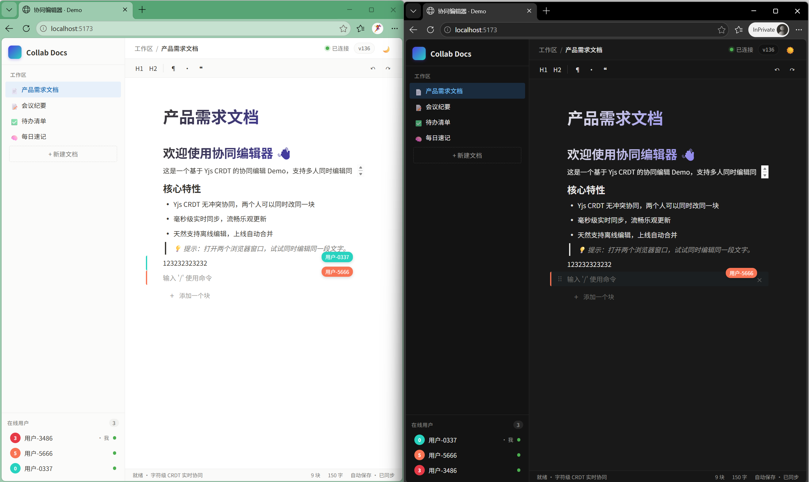
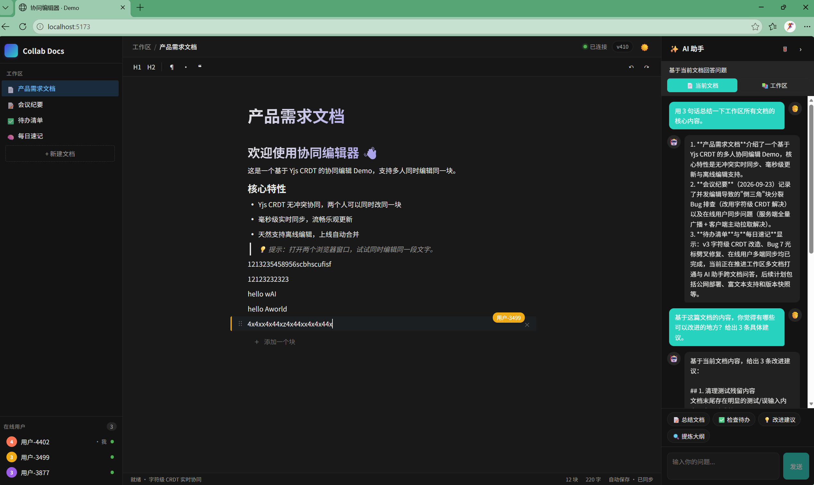
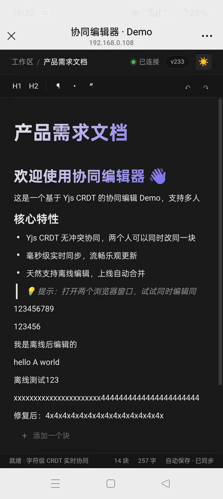

# 协同编辑器

**在线体验：[https://wky-collab.top](https://wky-collab.top)**（已部署公网，HTTPS + WebSocket）

基于 DOM 渲染的协同编辑器，从 **块锁 + 手写协议** 演进到 **CRDT（Yjs）**，完整记录思考过程与设计权衡。

## 演进概览

| v1（块锁） | v2（块级 CRDT） | v3（字符级 CRDT） |
|---|---|---|
|  |  |  |
| 块锁 + 手写协议 | 块级 CRDT（Yjs + Y.Map） | 字符级 CRDT（Y.Text） |
| 核心优先，UI 朴素 | 类 Notion 风格，体验升级 | 无冲突合并 + 光标同步 + 远程用户标签 |
| [`v1-block-lock`](https://github.com/wkyzcrhs/collab-editor/releases/tag/v1-block-lock) | [`v2-crdt-block`](https://github.com/wkyzcrhs/collab-editor/releases/tag/v2-crdt-block) | [`v3-crdt-text`](https://github.com/wkyzcrhs/collab-editor/releases/tag/v3-crdt-text) |

### v3 增强：AI 写作助手



基于 DeepSeek API 的流式 AI 助手，支持「当前文档 / 工作区」两种范围切换，内置「总结 / 检查待办 / 建议改进 / 提取大纲」快捷指令，SSE 逐字输出。采用轻量级 RAG（全量上下文注入），真正的向量检索见优化方向。

**技术栈**

- 前端：React + TypeScript + Vite
- 后端：Node.js + tsx + ws（WebSocket）
- 协同 v1：手写协议（乐观更新 / ACK / 重试 / 幂等 / 重连 / 块锁）
- 协同 v2：Yjs（CRDT）+ y-protocols + Y.Map（块级粒度）
- 协同 v3：Y.Text（字符级粒度）+ Y.RelativePosition 光标同步
- 持久化：服务端 y-leveldb，浏览器端 y-indexeddb（离线编辑）
- UI：类 Notion 风格侧边栏 / 工具栏 / 深色模式 / 5 种块类型 / 远程用户标签

## 移动端测试

手机与电脑同一 WiFi 下通过局域网 IP 访问，验证两端实时协同效果。

| v1（块锁）                                                           | v2（块级 CRDT）                                                        | v3（字符级 CRDT）                                                             |
| -------------------------------------------------------------------- | ---------------------------------------------------------------------- | ---------------------------------------------------------------------- |
|  |  |  |
| 两端都可编辑，同一块并发内容按到达顺序拼接（先到的在前）                                         | 块级 CRDT，两端同时编辑，操作保留但可能出现重复块                                            | 字符级 CRDT，两端内容自动收敛一致，光标自动避让                                        |

> 验证了 WebSocket 地址自动跟随页面域名，局域网访问开箱即用。

## 快速开始

```bash
# 1. 安装依赖
npm run install:all

# 2. 同时启动 后端(:8787) 与 前端(:5173)
npm run dev

# 3. 打开两个浏览器窗口
#    http://localhost:5173
```

手动分开跑：

```bash
npm --prefix server run start  # ws://localhost:8787
npm --prefix client run dev    # http://localhost:5173
```

**手机 / 局域网访问**：前端默认监听所有地址，启动后用 `Network` 那个 IP 访问（如 `http://192.168.1.7:5173`），WebSocket 地址自动跟随页面域名。

## 功能列表

| 板块               | 状态        | 说明                                  |
| ---------------- | --------- | ----------------------------------- |
| WebSocket 同步     | ✅         | Yjs sync + update 协议，增量同步           |
| Block / Block ID | ✅         | 每块唯一 ID，块级共享数组                      |
| 乐观更新             | ✅         | 本地立即生效，Yjs 后台同步                     |
| ACK              | ⚠️ 不再需要   | CRDT 最终一致 + 幂等，不需要 ACK 队列           |
| 断线重连             | ✅         | y-websocket 内置自动重连 + 心跳保活           |
| 操作重试             | ⚠️ 不再需要   | update 消息幂等，重复收到无副作用                |
| Block 锁          | ❌ 已移除     | CRDT 无冲突，不需要锁                       |
| 在线用户             | ✅         | Yjs Awareness 协议 + 心跳检测幽灵用户          |
| 文档版本             | ✅         | 操作累计计数（近似版本号）                       |
| Undo / Redo      | ✅         | Y.UndoManager（兼容中文输入法）              |
| 冲突处理             | ✅ 字符级 CRDT | Y.Text 逐字符无冲突合并，两端最终一致              |
| 服务端持久化          | ✅         | y-leveldb，服务重启数据不丢                        |
| 离线编辑             | ✅         | y-indexeddb，断网+关浏览器内容仍在，连网自动同步       |
| 用户光标             | ✅         | Awareness + Y.RelativePosition，显示远程用户在哪块编辑 |
| AI 助手            | ✅         | DeepSeek 流式回复，「当前文档 / 工作区」范围切换，全量上下文注入（小文档优先准确率） |

## 遇到的问题

以下问题来源于 v2 / v3 **手机 + 电脑真机并发测试**。前 3 个是块级 CRDT 架构的天然局限（升级 v3 的直接动机），后 4 个是前端层的工程问题。

| Bug | 现象 | 根因 | 修复 |
|---|---|---|---|
| 1 倒三角分裂 | 高频并发下块指数级增长 | 块级"删旧+插新"被并发保留 | ✅ v3 自动解决 |
| 2 删除失效 | 退格删不掉文字 | 块结构崩溃后 Block ID 错位 | ✅ v3 自动解决 |
| 3 幽灵绑定 / 撤销雪崩 | A 行输入 B 行跟着变 | 并发下块引用错乱 | ✅ v3 大幅改善 |
| 4 焦点错乱 | 新块输入跑到上一块 | React state 异步 + 光标丢失 | ✅ useRef + 光标追踪 |
| 5 输入法回退 | 撤销先回到拼音中间态 | UndoManager 记录了 composition | ✅ composition 拦截 |
| 6 局部死锁 | 特定相邻块写不进 | 同 Bug 4 | ✅ 同 Bug 4 |
| 7 光标劈叉 | 并发打字光标卡在中间 | 光标用绝对位置保存 | ✅ Y.RelativePosition |

两个最典型的问题：

### Bug 1：高频并发下的"倒三角"块分裂

两端在同一块内快速交替输入，块分裂成"倒三角"且指数级增长——块级 CRDT 每次更新是"删旧块 + 插新块"，并发下双方的删+插都被保留（CRDT 不丢数据）。这是升级字符级 CRDT 的直接动机。


### Bug 7：并发编辑时光标被"劈"在中间（v3 阶段发现）

两端同时打字，光标卡在中间不动、新内容从中间插入。根因是光标用**绝对位置**保存，对方在光标前插入时锚点不前移。改用 `Y.RelativePosition`（锚定在字符之后）后，光标始终跟在自己打的内容后面。


> 完整排查记录（每个 Bug 的操作步骤 / 现象 / 根因 / 修复方案）见 [docs/debug-log.md](docs/debug-log.md)。

## v3 调试记录：在线状态同步（Awareness 协议）

**现象**：电脑 2 窗口 + 手机 1 窗口，电脑端正确显示 3 人，手机端只显示 2 人，但光标、编辑标签等增量更新一切正常。

**根因**：Awareness 只广播"变化"。手机端漏掉某用户的某次增量更新后（后台 TCP 静默断开重连等），该用户后续无新变化便不再收到。电脑两窗口间有 BroadcastChannel 互备，手机没有——所以只有跨设备端缺人。

**三层修复**：

| 层级 | 方案 |
|------|------|
| 保底 | 服务端每 10s 全量广播完整在线列表 |
| 主动拉取 | 新增 `messageQueryAwareness` 协议，客户端可主动查询 |
| 触发时机 | `visibilitychange` 回前台时立即拉取 |

**延伸（幽灵用户）**：手机息屏 / 断网时 TCP 静默断开，服务端收不到 close 帧，需要应用层心跳（ping/pong，5s 周期）检测，断线 ~10s 内清除并广播下线。

> 完整排查过程见 [docs/debug-log.md](docs/debug-log.md)。

## 版本演进

| 版本     | Tag                 | 核心方案                      | 特点             |
| ------ | ------------------- | ------------------------- | -------------- |
| v1     | `v1-block-lock`     | 块锁 + 手写协议（乐观更新/ACK/重试/幂等） | 传统方案，易理解       |
| v2     | `v2-crdt-block` | 块级 CRDT（Yjs + Y.Map）          | 去掉锁，但粒度仍为块 |
| **v3** | **`v3-crdt-text`**  | **字符级 CRDT（Y.Text）**          | **真正的无冲突合并 + 光标同步**       |

## 目录结构

```
collab-editor/
├─ package.json          # 根：concurrently 一键启动
├─ shared/               # 前后端共享的类型
│  └─ types.ts
├─ server/
│  └─ src/index.ts       # ws 服务端：Yjs 同步协议 + Awareness + 心跳
└─ client/
   └─ src/
      ├─ useYjsDoc.ts    # 核心 hook：Y.Doc + WebsocketProvider + Awareness
      ├─ Editor.tsx      # 块编辑区 / 工具栏 / 块操作
      ├─ AIPanel.tsx     # AI 助手面板（DeepSeek 流式）
      ├─ App.tsx         # 侧边栏 / 顶栏 / 状态栏 / 深色模式
      └─ index.css       # 样式（浅色 + 深色主题）
```

## 数据结构设计

```
Y.Doc（文档根）
└── Y.Array "blocks"（块数组，有序，支持插入/删除/移动）
    ├── Y.Map Block 0         ← 第 0 块
    │   ├── id: string        ← 块唯一 ID（uuid）
    │   ├── kind: BlockKind   ← 块类型（paragraph / heading1 / bullet / ...）
    │   └── text: Y.Text      ← 块内容（字符级 CRDT，支持逐字 insert/delete）
    ├── Y.Map Block 1
    │   ├── id
    │   ├── kind
    │   └── text: Y.Text
    └── ...
```

### 为什么是 Document → Block 结构？

1. **块是协同的最小并发单元**——不同块之间天然无冲突，只有同一块内的并发才需要 CRDT 合并。块级隔离降低了冲突概率和复杂度。
2. **块是渲染的最小单元**——每块一个 textarea / DOM 节点，更新时只重渲染对应块，性能好。
3. **块是功能扩展的基础**——标题、列表、引用、代码块……都是"不同类型的块"，新增块类型不影响数据结构。

### 为什么每层选这个 Yjs 类型？（选型理由）

| 层 | 类型 | 选型理由 | 踩过的坑 |
|---|---|---|---|
| 块数组 | **Y.Array** | 有序、支持按 index 插入/删除，天然对应"行"的概念 | — |
| 块本身 | **Y.Map** | 字段级更新（`map.set('kind', ...)`）是**原地修改**，不会产生重复块 | v2 早期用 plain object + "删旧插新" → 并发下产生重复 ID 的块（Bug 1 倒三角） |
| 块文本 | **Y.Text** | 字符粒度 CRDT，每个字符的插入/删除都是独立操作，并发时自动合并 | v2 用整块 string 替换 → 并发互相覆盖、光标不同步（Bug 7） |

> 一句话总结：**Array 管顺序，Map 管字段，Text 管字符**——每层选择最适合粒度的共享类型，是整个项目最核心的设计决策。

## 关键设计说明

**为什么选 CRDT 而不是 OT？**  CRDT 天然支持离线编辑、不需要中央服务器做转换、开源库 Yjs 非常成熟。OT 需要中心化服务端做操作转换，且操作类型越多转换规则越复杂。现在的行业趋势（Figma / Notion / 飞书文档）都在向 CRDT 演进。

**为什么从块级升级到字符级？**  这是演进过程中的关键一步。v2 先用 Y.Map + 整块替换快速跑通 CRDT 整体流程（同步、Awareness、Undo/Redo），但暴露了"同一块并发产生重复块 / 光标不同步"等问题——这些不是 Yjs 的 bug，而是**块级粒度的天然局限**。v3 升级到 Y.Text 后，操作粒度从"整块"降到"单字符"，从根源上解决了这些问题。完整的思考链条比直接上 Y.Text 更有价值。

**A: Hello→Hello World，B: Hello→Hello AI，最终内容是什么？**  字符级 CRDT 下，**两组内容都保留**（`Hello WorldAI` 或 `Hello AIWorld`，取决于两端 clientID 排序），且**两端最终完全一致**（收敛性）。两端在同一位置交替打字时（如电脑打 4、手机打 x），字符按 clientID 排序穿插呈现为 `4x4x4x`，两边内容完全一致——这是 Yjs CRDT 的正常行为。CRDT 承诺的是：不丢数据 + 两端收敛一致。

## 未完成事项与优化方向

**当前未完成**：

- 精确光标渲染：远程用户只显示"在哪块编辑"，文本内的光标竖线未做
- AI 助手当前采用**全量上下文注入（Prompt Stuffing）**，以小文档场景下的准确率为优先；未来将随文档规模演进为「文档分块 → Embedding → 向量检索」的标准 RAG 架构
- 文档重命名 / 删除：工作区支持多文档切换与新建，但文档管理（重命名、删除）未实现

**继续开发的方向**：

1. **RAG 检索增强**：文档分块 + embedding + 向量检索，AI 问答带引用来源
2. **版本快照 / 历史回退**：Y.Snapshot 实现版本记录与回退
3. **富文本格式**：Y.Xml 支持加粗 / 斜体 / 链接
4. **评论 / 批注**：基于 Y.Array 的评论线程
5. **文档管理**：重命名 / 删除 / 收藏
6. **精确光标渲染**：在文本中显示远程用户的光标竖线

## 部署

已部署至公网：**https://wky-collab.top**

```
浏览器 → Nginx (80/443, HTTPS)
        ├─ /        → 前端静态文件（Vite 构建产物）
        ├─ /api/*   → 反向代理 → Node.js 后端（PM2 守护，:8787）
        └─ /ws/*    → 反向代理 → WebSocket（wss 加密，Upgrade 头透传）
```

- 腾讯云香港轻量服务器（免备案），Let's Encrypt 免费证书 + 自动续期
- 后端数据 y-leveldb 持久化，PM2 开机自启
- 详细部署步骤见 [docs/deploy-guide.md](docs/deploy-guide.md)

## License

MIT
