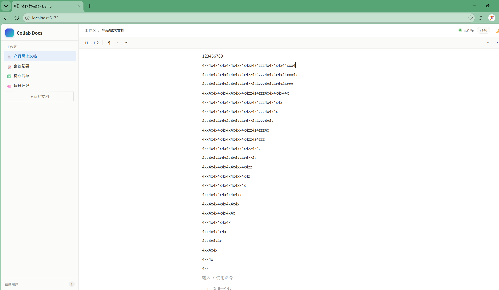
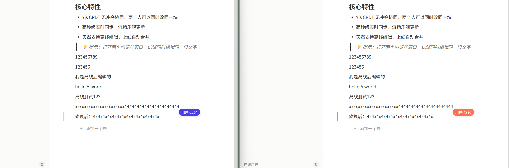

# 调试日志

> 本文档是 README 中「遇到的问题」的完整版，记录了 v2 → v3 真机测试中发现的所有问题及排查过程。

## Bug 1：高频并发下的"倒三角"块分裂

| 项目 | 说明 |
|---|---|
| **操作** | 两端同时在同一块内快速交替输入（电脑打 A，手机打 B，持续高频） |
| **现象** | 轻度并发时正常；高频后文本向上方堆积，块分裂成多行，上长下短呈"倒三角"，块数量指数级增长 |
| **根因** | 块级 CRDT 每次更新 = "删旧块 + 插新块"两个原子操作。高频并发下，双方的删+插都被 Yjs 保留（CRDT 不丢数据），导致新块不断在上方累积，形成倒三角 |
| **修复** | 升级到字符级 CRDT（Y.Text），操作粒度从"整块"降到"单字符"，不再有删+插的模式 |



## Bug 2：块结构崩溃后的删除失效

| 项目 | 说明 |
|---|---|
| **操作** | 出现倒三角后，用退格键逐字删除分裂块中的文字 |
| **现象** | 退格键无法删除文字，输入无反应；只有点"删除块"按钮能整块移除 |
| **根因** | 块结构分裂后，DOM 节点对应的 Block ID 与 Yjs 数组中的位置不再稳定对齐。按退格走的是"按 ID 查找 → 整块替换"路径，在 ID 查找失败或引用错乱时操作落空。删除块按钮走的是 Y.Array 元素级 API，直接定位删除，所以生效 |
| **修复** | 字符级 CRDT 后结构稳定，删除操作变为字符级，不再依赖整块替换 |

## Bug 3：幽灵绑定与撤销雪崩

| 项目 | 说明 |
|---|---|
| **操作** | 倒三角状态下，在第一行输入内容，或点击撤销按钮 |
| **现象** | **幽灵绑定**：在 A 行输入，B 行内容跟着变；**撤销雪崩**：越撤块越多，像爆炸一样 |
| **根因** | 块引用在并发冲突中错乱后，前端更新指令的目标块与用户预期不一致。UndoManager 记录的是"整块删除+插入"的操作历史，在结构已撕裂的状态下撤销，等于把之前所有并发分支都恢复出来 |
| **修复** | 字符级 CRDT + 稳定的块引用，从根源上避免块结构分裂 |

## Bug 4：输入焦点错乱（在 A 块输入，B 块变更）

| 项目 | 说明 |
|---|---|
| **操作** | 新建块后，在新块中输入文字；或快速在两块之间切换输入 |
| **现象** | 新块写不进去，字跑到上面那块去了，不断覆盖上一块的内容。两侧窗口显示的内容一致，但光标位置和输入目标块错位 |
| **根因** | 前端 activeBlockId 基于 React state 更新，state 是异步的。快速切换块时，工具栏/输入处理可能拿到上一个块的 ID。另外 Yjs 更新触发 re-render 后光标位置丢失，也加剧了错乱感 |
| **修复** | ✅ **已修复** — 用 `useRef` 替代 state 追踪当前块，确保同步获取；增加光标位置保存与恢复逻辑 |

<br />

## Bug 5：输入法（IME）与撤销机制的冲突

| 项目 | 说明 |
|---|---|
| **操作** | 中文输入法输入汉字，然后连续撤销 |
| **现象** | 撤销时先回到拼音中间态（如 "nihao"），再撤销一次才消失；撤销顺序与打字速度强相关（快打合并成一次，慢打分次撤销） |
| **根因** | Yjs UndoManager 无法区分"输入法拼音预输入"和"最终上屏的汉字"，把 composition 中间态也当成有效操作记录进历史了。这是**独立于 CRDT 粒度的通用问题**，无论块级还是字符级都会遇到 |
| **修复** | ✅ **已修复** — 监听 `compositionstart` / `compositionend`，输入法期间只更新本地输入，上屏后才一次性写入 Yjs，中间态不进入 UndoManager |

## Bug 6：局部相邻块"死锁"

| 项目 | 说明 |
|---|---|
| **操作** | 在第 N 行输入完成后，点击第 N+1 行继续输入 |
| **现象** | 第 N+1 行写不进去，输入的内容全部覆盖了第 N 行；只发生在特定相邻两行，其他块正常 |
| **根因** | 与 Bug 4 同源——前端状态与 CRDT 底层状态脱节的局部表现。高频操作后，聚焦块的 ref 和实际 DOM 焦点短暂不同步，导致写入目标错位 |
| **修复** | ✅ **已修复** — 同 Bug 4，ref 化 + 光标追踪大幅降低触发概率 |

## Bug 7：并发编辑时光标被"劈"在中间（v3 阶段发现）

| 项目 | 说明 |
|---|---|
| **发现阶段** | v3（字符级 CRDT / Y.Text）真机测试 |
| **操作** | 两端同时在同一块末尾打字（电脑打 4，手机打 x） |
| **现象** | 不是交替出现 `4x4x4x`，而是像被中间的光标"劈成两半"——一端的光标卡在中间不动，新内容从光标位置往前插入，两端文本越长，光标越往中间"凝固"。但两端最终文本完全一致（收敛性正常） |
| **根因** | 前端光标用**绝对数字位置**保存（比如"第 5 个字符"）。对方在你光标前插入字符时，你的光标不会自动前移，还停在原地，后续输入就从中间开始插入。这不是 Yjs 的问题，是**前端渲染层的光标锚点策略**问题 |
| **修复** | ✅ **已修复** — 用 `Y.RelativePosition` 替代绝对位置保存光标。光标不再是"第 N 个字符"，而是"锚定在某个字符之后"。对方插入字符时，锚点自动前移，Yjs 更新后重新解析为正确的绝对索引。光标始终跟在你自己打的内容后面 |



---

## v3 调试记录：在线状态同步（Awareness 协议）

这是 v3 字符级 CRDT 稳定后，在**多端真机测试**中发现的分布式状态同步问题。在线用户列表看似简单，实际上是一个典型的「最终一致性 + 故障检测」问题——和心跳检测、幽灵节点、分布式状态机是同一类问题。

### 现象

电脑开 2 个浏览器窗口 + 手机开 1 个窗口，共 3 个用户：

- ✅ 电脑端正确显示 **3 个**在线用户
- ❌ 手机端只显示 **2 个**（手机自己 + 电脑上的其中 1 个）

而且用户的打字光标、编辑标签都能正常同步——说明**增量更新能收到，但某个用户的初始状态漏掉了**。

### 排查过程

#### 第一步：排除渲染层

检查 `App.tsx` 的在线用户渲染逻辑：

```jsx
{collab.clients.map((c) => (
  <div key={c.clientId} className="presence-row">
```

用 `clientId` 做 key，没有去重、没有过滤。**渲染层没问题**。

#### 第二步：定位 Awareness 同步链路

电脑上的两个窗口之间有 **BroadcastChannel**（同浏览器跨标签页通信），它们不依赖服务端就能互相"看到"对方。但手机是独立设备，完全靠服务端的 WebSocket 广播。

只要手机端**漏掉了某一次增量更新**（比如连接瞬间的竞态、手机浏览器后台时 TCP 静默断开重连），就会一直少显示那个用户——因为 Awareness 协议默认只广播"变化"，那个用户的状态没有新变化就不会再发。

**关键证据**：电脑两个窗口之间通过 BroadcastChannel 互通，所以即使服务端漏发了，它们之间也能补全。但手机没有这个通道。

### 三层修复

| 层级 | 方案 | 说明 |
|------|------|------|
| **保底机制** | 服务端每 10 秒**全量广播**一次完整在线列表 | 漏掉增量更新的客户端，最多 10 秒后自动纠正 |
| **主动拉取** | 新增 `messageQueryAwareness`（消息类型 3） | 客户端可主动查询完整列表，不依赖增量推送 |
| **触发时机** | 手机 `visibilitychange` 回前台时主动拉取 | 后台冻结期间错过的更新，亮屏瞬间补回来 |

### 延伸问题：幽灵用户（断线检测）

关闭一个浏览器窗口后，其他端多久能感知到用户下线？

**TCP 的坑**：浏览器直接关闭标签页时，WebSocket 会发 close 帧，服务端立即感知。但如果是**网络断开 / 手机息屏 / 强制杀进程**，TCP 连接是"静默断开"的——服务端收不到任何包，也不知道对方已经挂了。

| 检测方式 | 延迟 | 说明 |
|---------|------|------|
| 正常关闭（close 帧） | 即时 | WebSocket 规范行为 |
| TCP 静默断开 | 取决于操作系统超时（通常几分钟） | ❌ 不可接受 |
| **应用层心跳（ping/pong）** | **~10 秒** | ✅ 我们的方案 |

**实现**：服务端每 5 秒向所有连接发 ping 帧，客户端浏览器自动回 pong。如果一个连接连续一个周期没回 pong，就 `terminate()` 掉，触发 close 事件 → 清理 awareness → 广播下线通知。

```
心跳周期 5s → 最坏情况：用户在 ping 刚发完就断线 → 等下一个 ping 周期检测到无 pong → 踢掉
总延迟 ≈ 5 ~ 10 秒
```

### 修复后验证

| 测试场景 | 预期 | 结果 |
|---------|------|------|
| 电脑 2 窗口 + 手机 1 窗口 | 三端都显示 3 个在线用户 | ✅ 通过 |
| 关闭电脑一个窗口 | 手机端 ~10 秒内用户消失 | ✅ 通过 |
| 手机息屏 30 秒再亮屏 | 在线列表快速恢复正确 | ✅ 通过 |

### 技术要点

1. **Awareness 协议的时钟机制**：每个客户端的状态带一个自增 `clock`，接收方只采纳更新的（`currClock < newClock`），防止旧消息覆盖新状态
2. **BroadcastChannel 与 WebSocket 的双链路**：同浏览器多标签页走 BC（零延迟），跨设备走 WS（服务端中转）
3. **刷新竞态（clientIdOwner）**：同一 clientID 快速重连时，旧连接的 close 事件不能误删新连接的状态——用"归属权"机制解决
4. **心跳间隔权衡**：太短费流量、费电；太长幽灵用户滞留久。5s 心跳 / 10s 内清除是移动端比较均衡的选择
